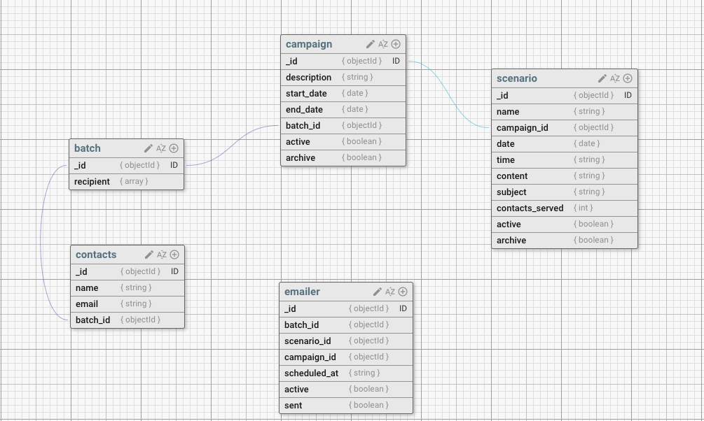

# Market Campaign Scheduler
> A platform which serves user with the ability to send email campaigns to their customers.

## Table of contents
* [Schema](#schema)
* [Flow](#flow)
* [Scheduler Logic](#scheduler-logic)
* [Sending Email](#sending-email)

## Schema 


## Flow

> Create Campaign

* User creates a campaign with a start and end date
* A new batch entry is created in the batch table and the batch_id is added to the campaign. 

> Upload Contacts

* User provides with a csv file which contains name and email of the customers. 
* A batch_id is assigned to each customer
* A subsequent entry is made into the batch table with the object ids of all the contacts
* 
  ```js
  _id,
  recipient:['1232gn12j1', '122rdg12j1']

  ```
> Create Scenario

* User creates a scenario providing the following info:
1. Subject: Plain text 
2. Content: Plain text
3. Date 
4. Time at which to send the email 
5. Assigns each scenario to a campaign

> List Scenario and Campaign

* User can view added campaigns and scenarios as a list 

## Scheduler Logic

A cron script runs daily at 6:00 am which basically runs the scheduler.

The scheduler does the following tasks order wise. 

1. List all active campaigns, calculating by the start and end date(timeline). 
2. If an active campaign is present, it then list all the scenarios, of these active campaigns, which are scheduled for the day.
3. If any scenario is present it then runs the following series of task for **each scenario**
    * Gets the campaign obj using the campaign_id.
    * Using the campaign obj it gets the batch_id
    * Then it makes an entry into the `emailer` table with the batch_id, scenario_id and campaign_id,    and the time at which it is scheduled to run. 
    * The newly made `emailer entry` is marked as `active:true` and `sent:false`
4. Once the entry is made, a cron script is then scheduled to run at the time specified in the scenario.
   emailer `_id` is passed into each cron script.

## Sending Email

The cron script schduled to run for a scenario performs the following tasks.

1. Using the emailer_id it first gets the emailer obj
2. batch_id present in the emailer obj is then used to fetch the batch obj
3. Similarily, scenario_id present in the emailer obj is used to fetch the scenario obj
4. Now using the batch obj fetched, all the contacts are listed using `recipient array`
5. Finally, phew, For each contact:
   * An email is sent to the customer using scenario content and subject  
6. Once the email is sent, the emailer entry is marked is `active:false` and `sent:true`
7. The scenario entry is also updated with the number of contacts served.

## Code structure

* core -> backend
* web  -> frontend

## TODOs

* The recipient of an email should be able to unsubscribe from the campaign.
* Once unsubscribed, the system will not send them an email from the currently running campaign.


